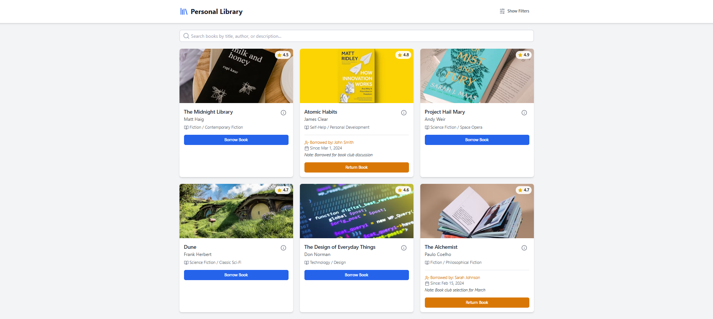

# 📚 Book Library Web App

A **Book Library Web App** for managing a personal collection of books. Users can **search, categorize, and view borrowing history** efficiently.

---

## 🚀 Features

✅ Add, Edit, and Delete Books  
✅ Search and Categorize Books  
✅ Borrowing History Tracking  
✅ User-Friendly Interface  

---

## 📸 Screenshot



---

## 🛠️ Technologies Used

- **HTML5** - Structure  
- **CSS3** - Styling  
- **JavaScript** - Functionality  

---

## 📦 Installation

1️⃣ Clone the repository  
```sh
git clone https://github.com/your-username/HexSoftwares_Book_Library.git
